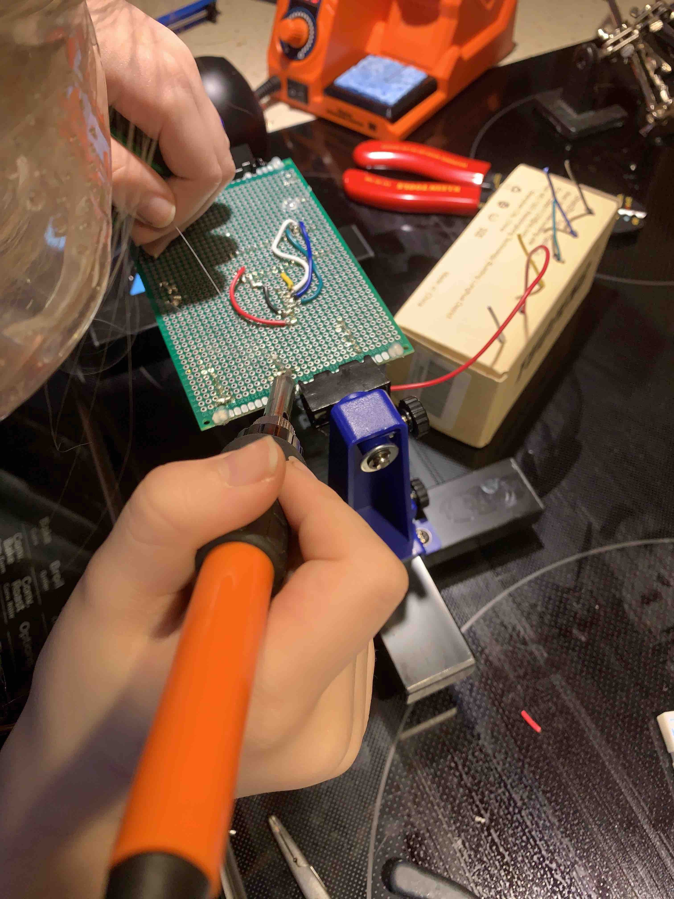
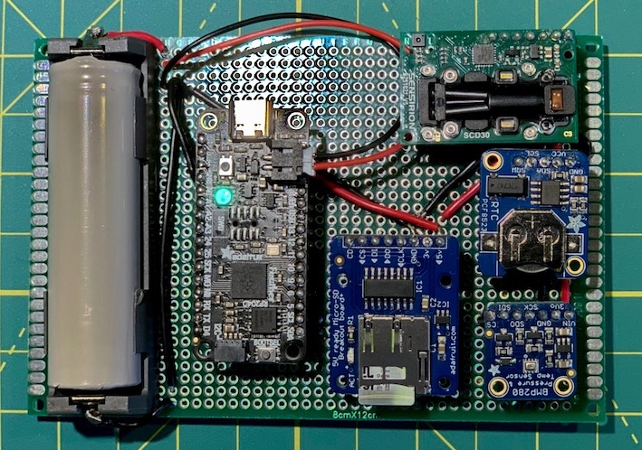

# Build a CO2 data logger for your school

Kids, parents and teachers wonder if the air quality and ventilation in classrooms meet the recommendations for low-transmission of Covid-19.


It turns out that you can get a pretty good indication of ventilation by measuring carbon dioxide (CO2). Everyone breathes out CO2, as every kid knows. Poor ventilation increases the risk of Covid-19 spreading. CO2 in a classroom increases when ventilation is poor. CO2 level below 1000 parts per million (ppm) is generally considered good ventilation. CO2 level outdoors is about 410 ppm.

You might think that you need an expensive consultant to come to school with a fancy machine, and if schools measure CO2, they don't tell the kids. What's a kid supposed to do?

In our house, there is a saying, "don't come to me with a problem unless you have a solution." This proclamation was told to me on occasion by [David Naylor](https://twitter.com/cdavidnaylor) when I was a new public health researcher, and it is now part of our family rules. As a parent, it seems that the solution to kids' problems is often ice cream or getting out of chores, but there is also plenty of innovation.

We've been poking around with electronics in our house during the Covid-19 pandemic. The kids came with a solution to build our CO2 monitor. We got to work. We designed and built a CO2 monitor using a microcontroller and a data logger.

My kids' classrooms are in the 100-year old [Hopewell Public School](https://hopewellaveps.ocdsb.ca/) in Ottawa. They both took the monitor into their classrooms for a day (grade 4 and 6). It turned out the CO2 levels were excellent!

We are passing along our plans so you can make your CO2 data logger to take to your school.

 
 <figcaption>Hopewell Public School - Old Ottawa South, Ottawa</figcaption>

## Hardware selection

We built our CO2 data logger around the new [Adafruit RP2040 Feather](https://www.adafruit.com/product/4884). The RP2040 is the microcontroller of the year - a new offering from the Raspberry Pi foundation, with their Pico version costing just $4 USD. Adafruit's version costs a bit more, but it includes a LiPoly battery connector and a NeoPixel LED, which we knew would come in handy.

You don't need to use an RP2040. We first created a prototype using an original Arduino Uno, but we found the memory just a bit tight. We used the RP2040 because we were keen on trying our hands at programming in Circuitpython, and the RP2040 supports Circuitpython, Micropython, C++, and Arduino's C++. All set!

The only other required hardware is a CO2 sensor. We used the [SCD30](https://www.adafruit.com/product/4867), but there are [cheaper sensors](https://www.adafruit.com/product/3709) that would work perfectly well for gauging ventilation in a classroom.

We tricked out our logger out with a few optional features, including:

- a [real-time clock](https://www.adafruit.com/product/3295) to know the exact time for each CO2 reading.
- a [temperature, altitude and barometer sensor](https://www.adafruit.com/product/3966) to get more data. The altitude reading let us know when the sensor was in the kids' classroom because it is four floors up from the playground outside. We looked at the data to see when altitude increased, which corresponded to the start of class.
- a [micro SD-card reader](https://www.adafruit.com/product/254) for data logging. The Adafruit RP2040 Feather comes with 8 MB SPI Flash memory, which is plenty for a day or more data logging. We found it convenient to pop out the SD card for our data management and analysis.
- a 18650 battery, but any LiPoly battery will do.

Note that we didn't use a display. That was a design choice we considered carefully. We figured that the teachers wouldn't appreciate a kid constantly looking at the screen readout. Instead, we took a more subtle approach and programmed the NeoPixel with different colours indicating the CO2 reading level. The kids planned to take a very, very long bathroom break if it started flashing red. Fortunately, the LED was green the whole day.

You don't need a data logger. The minimal sensor could be a microcontroller, a CO2 sensor and a LED or neopixel that flashes or has different colours indicating the CO2 level—green for good, yellow and red for higher cut-offs. If you don't have a neopixel could use a single flashing LED, something like slow flash = good, CO2 is low; quick flash = warning, CO2 is high.

### Assembly

First, we made a breadboard prototype and got everything working.


<figcaption>Left to right: Feather RP2040; CO2 monitor; temperature, pressure, altitude; real-time clock; micro SD-card reader</figcaption>
 
#### 
Next, we made our "production" version of the CO2 logger by soldered the sensors on a circuit board. Another saying in our house is any day soldering is a good day 🌞 —and a kid's small hands are perfect for soldering electronics.


<figcaption text-align="right">Small hands work well for soldering</figcaption>

####
Be careful with those connections. Sensor breakout boards put the connectors in different arrangements. My kids and I were careful to keep the wires in order, but we still got it mixed up once or twice. We soldered one sensor at a time, checking after each soldering with program code to ensure we got sensor readings. We used lead-free solder—a must—and Toby is wearing her goggles in the picture—another must. If you look carefully, our soldering desk is our kitchen stovetop. The hood above the stove has good lighting and a fan that vents outside. 👍

Instead of soldering, you could use sensors with [STEMMA QT](https://learn.adafruit.com/introducing-adafruit-stemma-qt) connectors. The code would be identical, and it would be faster to make, but you won't have fun soldering.


<figcaption>The final product! Green light, the CO2 level is good!</figcaption>

## Code

The kids favourite coding language is [Scratch](https://scratch.mit.edu) and [MakeCode](https://microbit.org/code/). If you have kids who want to get started with electronics, I'd recommend [micro:bit](https://microbit.org) and MakeCode. We ended up programming in Circuitpython because there isn't a CO2 sensor MakeCode library, and I wasn't up for learning how to program one.

I did most of the typing because kids aren't yet comfortable coding in Python. The kids were great with the program design because it is the same programming design as Scratch and MakeCode (no mistake by the developers of those languages). The kids were also great at debugging. My daughter took the code to show her class. When explaining the code, she noticed a bug in the colours for the LED. I asked her if she told her teachers or classmates. "No, Dad, you wrote that part of the code, and I didn't want to embarrass you." Thanks, buddy! 🙏

For the most part, the code followed examples from the Adafruit website. We first used the example code for each sensor and breakout board and then we combined the code snippets into our final code. Here: [code.py](code.py) Don't forget the libraries for the sensors, they are [here](/lib).

There are only a few parts of the code that you'll need to change if you are using a microcontroller board that is different from the Adafruit RP2040 Feather:

- We used pin 10 for the SD chip select line. Change this to whatever works for you.

```python
# pin for SPI chip select line to wake up SD card.
# You'll need to change this pin name if you aren't using D10
# on your controller.

sd_cs = board.D10
```

- Not all boards have a neopixel, or there may be a different pin.

```python
# setup the neopixel. This code will need to be changed if you
# use a microcontroller other than an Adafruit feather

pixels = neopixel.NeoPixel(board.NEOPIXEL, n=1, brightness=0.05, auto_write=False)
```

The code isn't perfect. We have found that the logger can crash after a few hours, and we haven't debugged that yet. Feel free to make a GitHub issue or PR if you've got a suggestion, or we'll debug when we've got a chance. For now, the kids just reset, and a new CSV file is generated. We stitch together the files later.

## Data analyses

We took a quick look at the data from our kid's classrooms, and the reading looks excellent. For fun, we took readings every 5 seconds, which is a bit of an overkill. But why not play with a lot of data?

We will post how to plot the data and generate averages. We will probably do that in R because that is the more common statistical language in my field of public health, straightforward to code these sorts of analyses and gives the kids a chance to see if they like the language. The kids will take the analyses and data back to class.

## Collaborating

Suggestions welcomed by GH [Issues](https://github.com/DougManuel/CO2-logger/issues) or [PR](https://github.com/DougManuel/CO2-logger/pulls).

## Acknowledgements

Thanks to Adafruit and Lady Ada for everything they do. The kids and I watch and learn from many Adafruit videos and resources.

CO2 icon: https://commons.wikimedia.org/wiki/File:Co2_carbon_dioxide_icon.png
